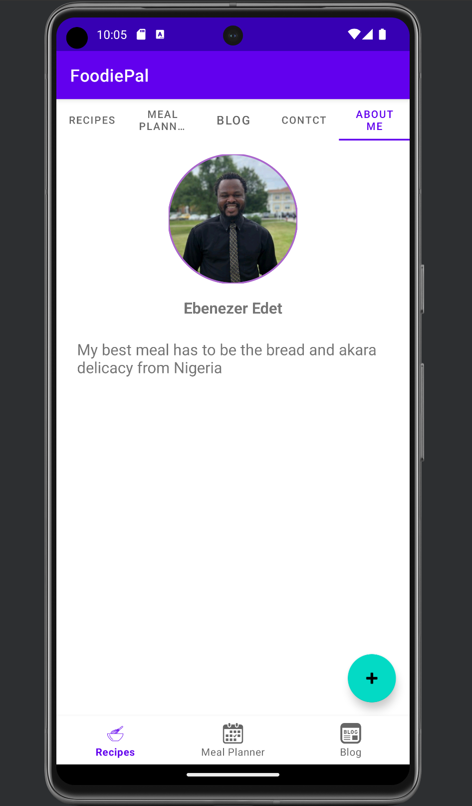

# foodiePalApp created by Edet, Ebenezer

The foodiePalApp was designed with the intention to create a culinary experience for users with the below features:

1. A Login page
2. Add new recipes
3. Setup a meal planner
4. Add a blog post
5. Call / Email the chef
6. An About me page

Below are pictures of the features above

# Login

# Wrong user credentials during login

# Recipe Page

# Add new Recipe dialog

# Recipe Added action

# Add Meal Planner dialog

# Meal Plan Added successfully

# New Blog Dialog

# New Blog added successfully

# Contact Page

# About Me Page

# Add detail dialog

# Details added successfully
